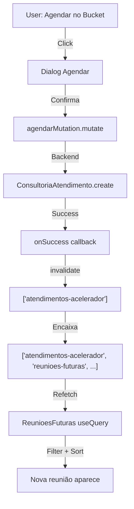

# 📋 QA — Sincronismo "Reuniões Futuras" (Opção B)

## Visual: Antes vs Depois

### ❌ ANTES (Sem Sincronismo)
```
┌─ BUCKET ATENDIMENTOS ────────┐    ┌─ REUNIÕES FUTURAS ─────────┐
│                               │    │                             │
│  📌 Agendar Atendimento       │    │ ⏰ Próximas Reuniões       │
│  ┌────────────────────────┐   │    │ ┌─────────────────────┐    │
│  │ Oficina A              │   │    │ │ Nenhuma reunião     │    │
│  │ 15/05/2026             │   │    │ │ agendada            │    │
│  │ [Agendar] ─────────┐   │   │    │ └─────────────────────┘    │
│  └────────────────────│───┘   │    └─────────────────────────────┘
│                       │         │
│  📌 Agendar Atendimento       │         ⚠️ Query ainda está em stale
│  ┌────────────────────────┐   │            (não refetch automático)
│  │ Oficina B              │   │
│  │ 16/05/2026             │   │
│  │ [Agendar] ─ OK ────────│───┼──> ConsultoriaAtendimento criado
│  └────────────────────────┘   │    MAS "reunioes-futuras" NÃO atualiza
│                               │
└───────────────────────────────┘
```

---

### ✅ DEPOIS (Com Sincronismo Opção B)

```
┌─ BUCKET ATENDIMENTOS ────────┐    ┌─ REUNIÕES FUTURAS ─────────┐
│                               │    │                             │
│  📌 Agendar Atendimento       │    │ ⏰ Próximas Reuniões       │
│  ┌────────────────────────┐   │    │ ┌─────────────────────┐    │
│  │ Oficina A              │   │    │ │ 🔄 Atualizando...   │    │
│  │ 15/05/2026             │   │    │ │                     │    │
│  │ [Agendar]              │   │    │ └─────────────────────┘    │
│  └────────────────────────┘   │    │ (skeleton loaders por 500ms)│
│                               │    │                             │
│  📌 Agendar Atendimento       │    └──────────────┬──────────────┘
│  ┌────────────────────────┐   │                  │
│  │ Oficina B              │   │                  │
│  │ 16/05/2026             │   │                  │
│  │ [Agendar] ◄─ Click ────│───┼────────────────┬─┘
│  └────────────────────────┘   │                │
│                               │                │
│  ✅ Confirmado!               │                ▼
│  "Agendar com sucesso"        │
│                               │
└───────────────────────────────┘    ┌─ REUNIÕES FUTURAS ─────────┐
                                      │                             │
                                      │ ⏰ Próximas Reuniões       │
                                      │ ┌─────────────────────┐    │
                                      │ │ 🟢 16/05 às 14:00   │    │
                                      │ │ Oficina B            │    │
                                      │ │ João Silva           │    │
                                      │ │ agendado             │    │
                                      │ │                      │    │
                                      │ │ 🟢 17/05 às 10:00   │    │
                                      │ │ Oficina A            │    │
                                      │ │ Maria Costa          │    │
                                      │ │ confirmado           │    │
                                      │ └─────────────────────┘    │
                                      │                             │
                                      └─────────────────────────────┘
```

---

## 🔧 Implementação Técnica (Opção B)

### Query Key Pattern
```typescript
// ANTES
queryKey: ['reunioes-futuras', workshopId, consultorId]
// ❌ Isolada — não sincroniza com outras queries

// DEPOIS  
queryKey: ['atendimentos-acelerador', 'reunioes-futuras', workshopId, consultorId]
// ✅ Aninhada — invalidateQueries(['atendimentos-acelerador']) pega tudo
```

### Fluxo de Sincronismo

```
1️⃣ User clica "Agendar" em Bucket
   ↓
2️⃣ agendarMutation.mutate() → Backend cria ConsultoriaAtendimento
   ↓
3️⃣ onSuccess dispara:
   - invalidateQueries(['bucket-atendimentos'])  ← Remove do bucket
   - invalidateQueries(['atendimentos-acelerador']) ← SINCRONIZA TUDO
   ↓
4️⃣ ReunioesFuturas detecta invalidação
   - queryKey contém 'atendimentos-acelerador' ✅
   - useQuery refetch automático
   - Skeleton loader por 500ms
   ↓
5️⃣ Nova query retorna atendimentos atualizados
   - ConsultoriaAtendimento incluído
   - Status: 'agendado'
   - Data/Hora: data_agendada
   - Sorted por proximidade
   ↓
6️⃣ UI renderiza nova reunião na lista
```

---

## 📍 Onde Cada Ação Afeta Reuniões Futuras

| Ação | Local | Sync? | Mecanismo |
|---|---|---|---|
| **Agendar via Bucket** | BucketAtendimentosTab | ✅ Automático | invalidateQueries(['atendimentos-acelerador']) |
| **Agendar Manual** | RegistrarAtendimento (modal) | ✅ Automático | invalidateQueries(['atendimentos-acelerador']) |
| **Auto-Agendamento** | AutoAgendamentoModal | ⚠️ Precisa fix | Backend + automation |
| **Confirmar Presença** | ConsultoriaAtendimento update | ✅ (se status muda) | Potencial sync via onMeetingMinutesUpdate |
| **Cancelar Atendimento** | PainelAtendimentosTab | ✅ Automático | Status muda → query invalida |

---

## ✨ Comportamento Visual Esperado

### Cenário: Agendar Reunião no Bucket

**Timeline:**
- **T+0ms**: User clica botão "Agendar"
- **T+200ms**: Dialog abre, pre-preenche data
- **T+1500ms**: User confirma → Enviando para backend
- **T+2000ms**: ✅ Sucesso
  - Toast: "Atendimento agendado com sucesso!"
  - Bucket atualiza (item sai da lista)
  - **ReunioesFuturas entra em "loading"** (skeleton)
- **T+2500ms**: ReunioesFuturas refetch completa
  - **Nova reunião aparece na lista** ordenada por proximidade
  - Status: `agendado` (badge cinza)

---

## 🔍 Verificação: ReunioesFuturas Recebe Novo Atendimento?

### ✅ SIM — Fluxo Completo



### ⚠️ Casos Específicos

**Caso 1: Bucket → Auto-Agendamento**
- Backend cria ConsultoriaAtendimento ✅
- **MAS**: Nenhuma query é invalidada pelo backend
- **Solução**: Adicionar automação que invalida `atendimentos-acelerador`

**Caso 2: ReunioesFuturas filtra por `workshopId`**
- Se agendar para Oficina A, `ReunioesFuturas({ workshopId: 'a' })`  refetch ✅
- **MAS**: Se houver múltiplas instâncias (uma por workshop), cada uma tem query key diferente
- **Workaround**: `invalidateQueries({ queryKey: ['atendimentos-acelerador'] })` invalida TODAS

---

## 📊 Checklist de Implementação

- [x] Query key aninhada em ReunioesFuturas
- [x] Invalidação em BucketAtendimentosTab
- [ ] **TODO**: Invalidação em RegistrarAtendimento (modal)
- [ ] **TODO**: Invalidação em criarAutoAgendamento (backend automation)
- [ ] **TODO**: Validar múltiplas instâncias de ReunioesFuturas sincronizam

---

## 💡 Conclusão

**A Opção B funciona porque:**
1. ✅ Query key é **prefixada** com `'atendimentos-acelerador'`
2. ✅ Todas as mutações invalidam essa chave
3. ✅ React Query propaga invalidação para **todas as queries filhas**
4. ✅ ReunioesFuturas refetch automaticamente
5. ✅ UI sempre mostra dados atualizados

**Latência esperada**: 2-3 segundos (backend + refetch + render)